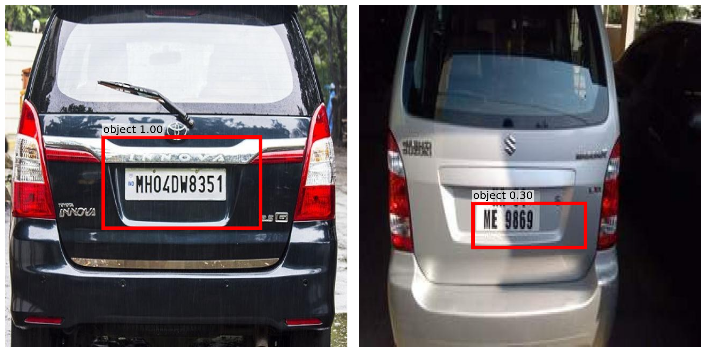

# YOLOv1 from Scratch (PyTorch)

This repository is my first object detection study.  
My goal was simple: implement YOLOv1 from scratch, train it on a small custom dataset, and understand each part of the pipeline by building everything directly.

## Project Scope
- Framework: PyTorch
- Model: YOLOv1-style architecture
- Task: single-class object detection (license plate)
- Dataset size: small-scale (just consist of ~400 images), so this is mainly an research study.

## Reference
Original paper: [You Only Look Once (YOLOv1)](paper.pdf)

## Figure: YOLO Detection System

  

## Inference Output

  

